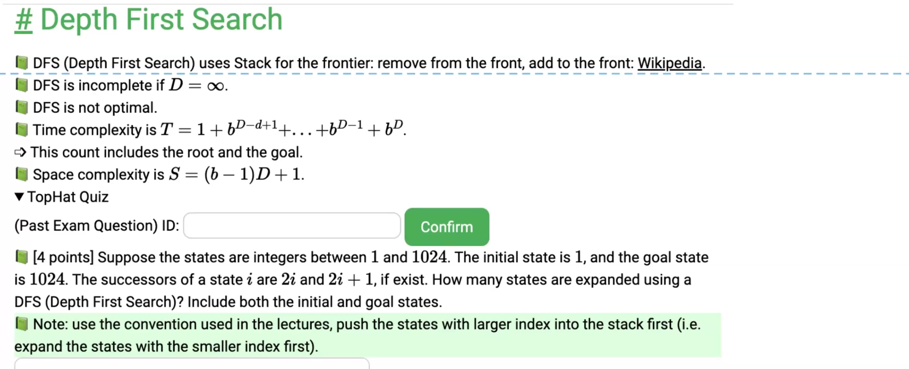  
worth case: can reorder the branches  
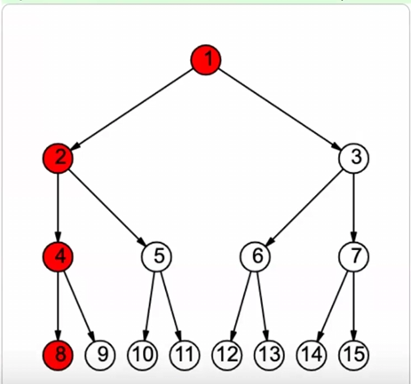
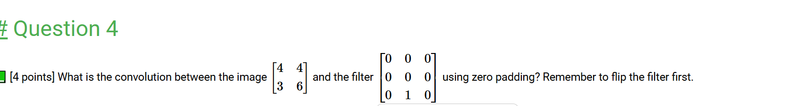
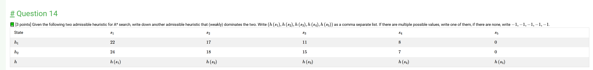
the heuristics must be admissible to reduce the path. 
h is admissible = h never overestimate the true cost to the goal   
  
s is some state.  
h(s) = heuristic estimate from s to the goal state  
c(s) = optimal cost from s to the goal.   
if question solved, then c(s) will be the one that will be returned.  
  
h admissible = for all states, h(s) <= c(s)  
as long as admissible, returned is optimal, but not necessary optimal.  
ex: when h(s) = 0,  
g(s) = the cost from the start state to s  
Priority: s = g(s) + h(s) = g(s), which is uniform cost search  
so h should be large as possible  
  
Heuristics is consistent/monotone  
<=> 
1. the h(goal) state is 0
2. h(s) <= c(s,n) + h(n)
c for the step cost  
other words, the is true for every neighbor n and the goal state.  

  
h consistent => h admissible  
the opposite is not always true but usually true.  
  
https://pages.cs.wisc.edu/~yw/CS540S24CX3.html
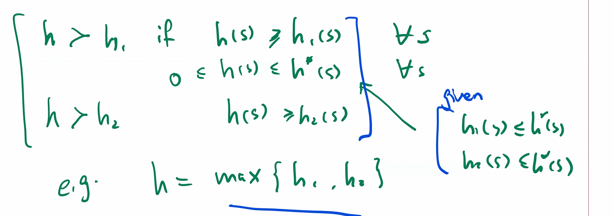  
  
 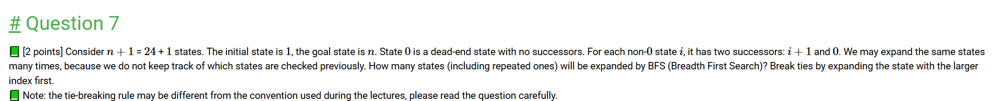  
 IDS  
 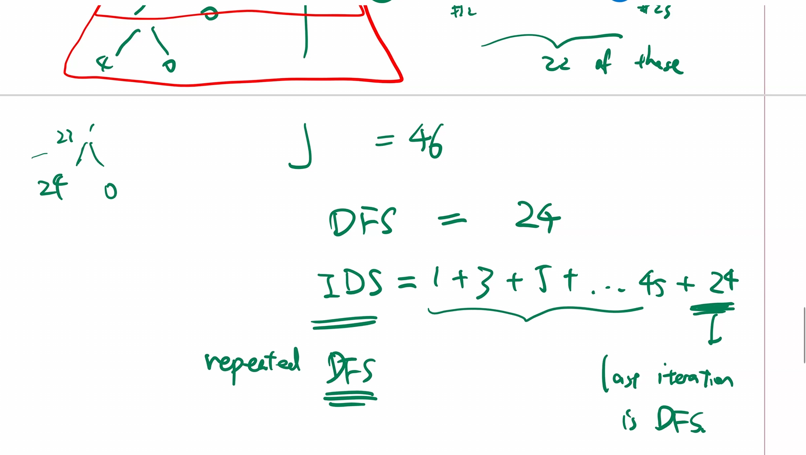
 the last one is DFS, 
 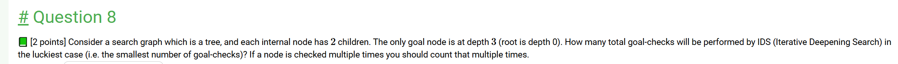
 the last round of the IDS is a DFS, so the luckiest case, the last round should be added to the depth of the goal.  
goal check = expansion   
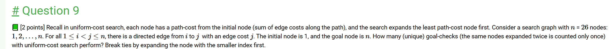
Uniform cost search = Dijkstra  

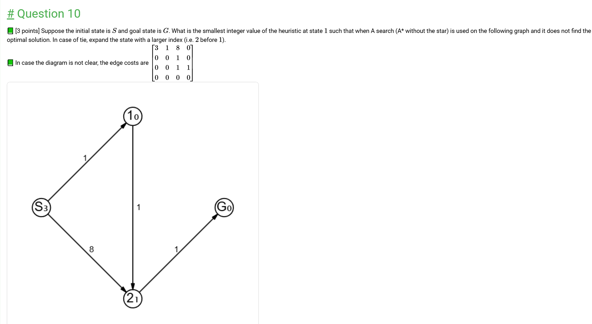

c(s) + h(n) expand the one with lower value.  
  
when the heuristic is lower than the actual length of the rought, then A search is called A* search  

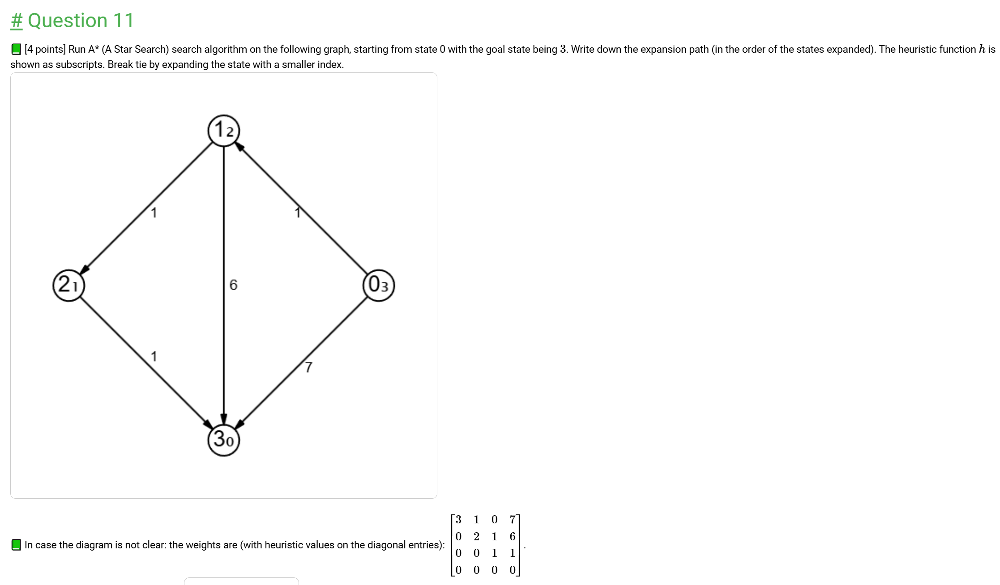
best first greedy search (run greedy)   
only base on the heuristics  

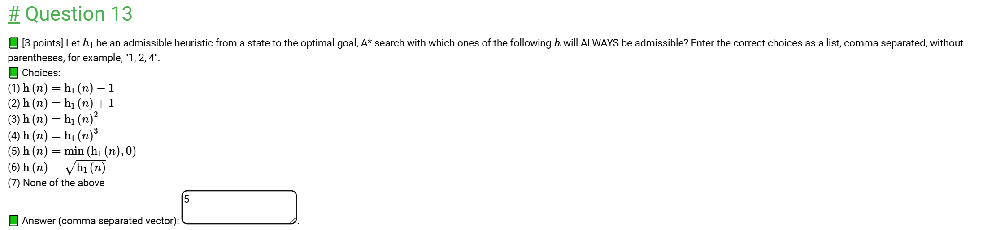

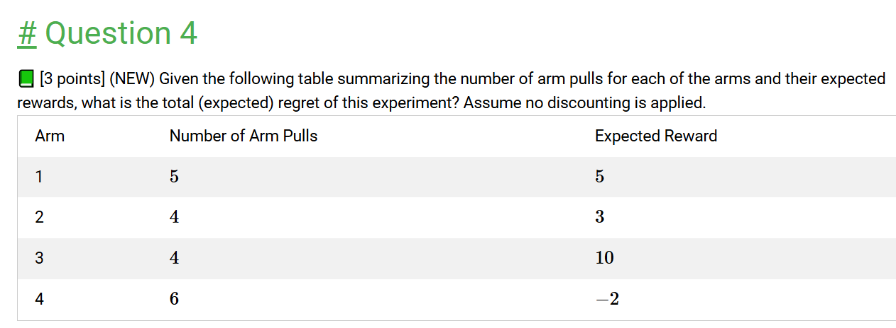
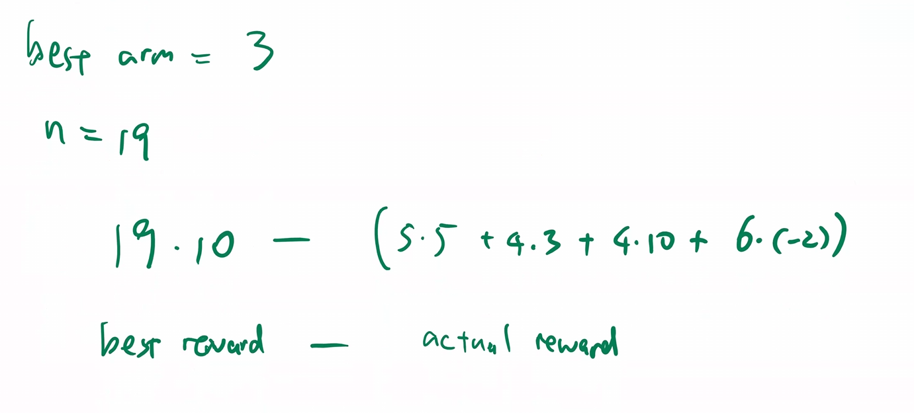
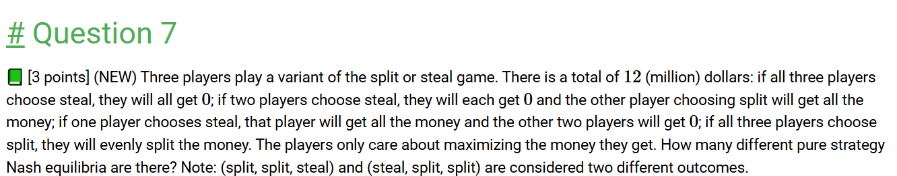

https://pages.cs.wisc.edu/~yw/CS540S24CX4.html

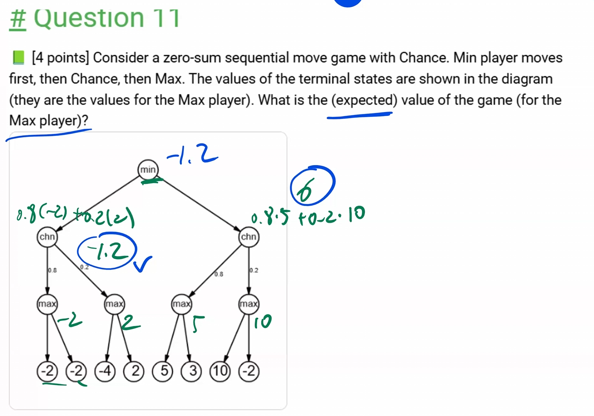
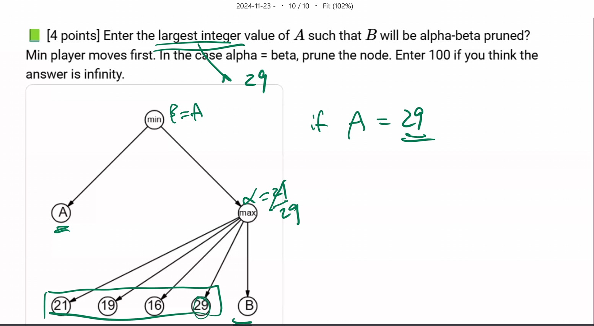

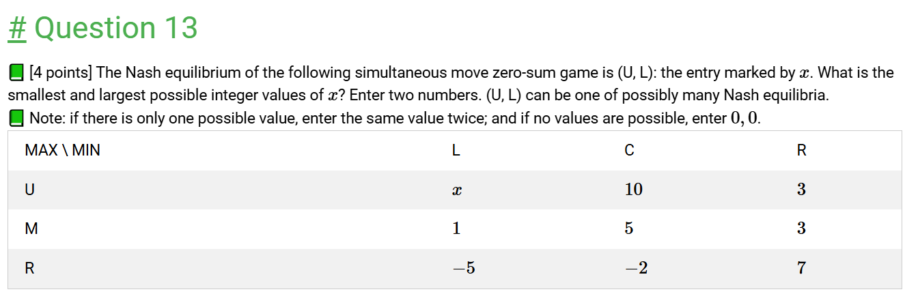

